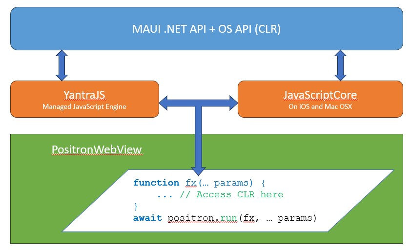

# Positron Web View
An Advanced Web View based Maui Project. This project was inspired from Cordova/Capacitor. However, building native plugins is very time consuming. Maui offers single language to write native plugins easy on any platform. So we decided to create Capacitor for Maui.



# Get Started
[](https://www.nuget.org/packages/NeuroSpeech.Positron)

1. Create an empty folder
2. Run `npm init`
3. Run `npm install -s @positron-js/cli`
4. Run `node ./node_modules/@positron-js/cli init`
5. Run `npm install` again.

This will create a maui project inside maui folder. Along with build scripts to publish.

# Publish
To publish the project, you must execute `.jsx` file with `@neurospeech/jex` as shown below.

`node ./node_modules/@neurospeech/jex/index.js ./build-android.jsx`

Jex is a new scripting engine that executes jsx files as a build script, and you can easily edit them and utilize JavaScript in the build script.

# Access .NET Inside Browser

Positron exposes `positron` property on `window` object, with `run` method. Positron installs JavaScript engine (YantraJS in Android and JavaScriptCore in iOS), which integrates with CLR. So you can write JavaScript that access CLR objects directly.

## Example Get DeviceToken

Lets assume that we have configured push messaging and we want to retrieve the device token. (For convenience, we have created Positron class that gives you deviceToken).

```javascript

    /** This global variable is just for compilation */
    let global;

    /** Although syntactically correct, this function
     * will be executed inside Positron's JavaScript Engine.
     * And the result will be available after successful execution.
     * 
     * This function cannot contain any closer except `global`;
     */
    function getDeviceToken(unread) {
        const Positron = global.clr
            .resolveType("NeuroSpeech.Positron.Positron, NeuroSpeech.Positron");
        try {
            const Badge = global.clr
                .resolveType("CommunityToolkit.Maui.ApplicationModel, CommunityToolkit.Maui");
            Badge.default.setCount(u);
        } catch {
            // ignore error...
        }
        return Positron.instance.deviceToken;
        
    }

    /** Basically positron.run() will send script text and parameters (as json) to Positron's JavaScript engine*/
    const deviceToken = await positron.run(getDeviceToken, 0);

```

## Example Open Url

```javascript

    /** This global variable is just for compilation */
    let global;

    /** Although syntactically correct, this function
     * will be executed inside Positron's JavaScript Engine.
     * And the result will be available after successful execution.
     * 
     * This function cannot contain any closer except `global`;
     */
    function openUrl(unread) {
        const Browser = global.clr
            .resolveType("Microsoft.Maui.ApplicationModel.Browser, Microsoft.Maui.Essentials");
        await Browser.openAsync(url, "External");
    }

    await openUrl("https://socialmail.me");

```

## Create New Instance

```javascript


    /** This global variable is just for compilation */
    let global;

    function openUrl(unread) {
        /** Types */
        const BrowserLaunchOptions = global.clr
            .resolveType("Microsoft.Maui.ApplicationModel.BrowserLaunchOptions, Microsoft.Maui.Essentials");
        const Color = global.clr
            .resolveType("Microsoft.Maui.Graphics.Color, Microsoft.Maui.Graphics")
        const Browser = global.clr
            .resolveType("Microsoft.Maui.ApplicationModel.Browser, Microsoft.Maui.Essentials");

        const options = new BrowserLaunchOptions();
        options.preferredToolbarColor = Color.parse("Orange");
        await Browser.openAsync(url, options);
    }

    await openUrl("https://socialmail.me");

```

# Naming Convention

Method and property names of CLR objects are converted to camel case.

# Security

PositronWebView has property called `ShouldInvokeScript`, you can set it to a function that accepts string and returns true/false.

# License

The project is licensed as GPLv3 as well as Commercial License. Commercial license is available for USD $100 per app per platform. This is lifetime license with unlimited free updates.

Please contact us at support at neurospeech dot com to get the license.
